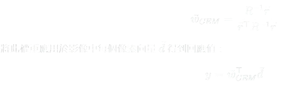
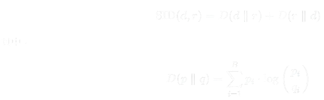
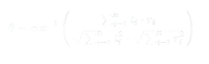

# Target-detection-apple

## 📐 CEM 公式
Constrained Energy Minimization（CEM）是一種經典的目標檢測方法，其核心思想是在保留目標響應的前提下最小化背景響應能量。
這是一種線性濾波器方法，常用於高光譜影像目標偵測，效果穩定且具備理論支持。

### 📘 符號說明：

- `r = [r₁, r₂, ..., r_B]`：參考光譜向量（**target spectrum**）
- `d = [d₁, d₂, ..., d_B]`：像素光譜向量（**image spectrum**）
- `R`：背景協方差矩陣（通常是整張影像或選定背景區域的樣本共變異矩陣）
- `w_CEM`：CEM 濾波器權重向量
- `y`：該像素經過 CEM 濾波器後的回應值（越大代表越像目標）
- `B`：光譜波段數

---

## 📐 SID 公式
SID 是一種衡量兩個光譜向量之間機率分布差異的指標，考慮的是光譜形狀的機率分布差異，對細微差異更敏感，常用於高光譜影像分類與目標偵測。

---

### 📘 符號說明：

- `r = [r₁, r₂, ..., r_B]`：參考光譜向量（**target spectrum**）  
- `d = [d₁, d₂, ..., d_B]`：像素光譜向量（**image spectrum**）  
- `pᵢ = dᵢ / sum(d)`：將像素光譜向量正規化為機率分布  
- `qᵢ = rᵢ / sum(r)`：將目標光譜向量正規化為機率分布  
- `D(p‖q) = ∑ pᵢ · log(pᵢ / qᵢ)`：p 相對於 q 的 Kullback–Leibler 散度  
- `SID(d, r) = D(p‖q) + D(q‖p)`：SID 為雙向 K-L 散度的總和  
- `B`：光譜波段數  
- SID 越小表示兩光譜越相似
---

## 📐 SAM 公式
Spectral Angle Mapper (SAM) 是一種用於光譜資料分析的技術，可評估兩個光譜之間的相似程度。它常被應用於高光譜影像處理、分類與目標識別任務中。
SAM 根據兩個光譜向量之間的夾角進行比對，定義如下：

---

- `r`：參考光譜向量（target spectrum）
- `d`：像素光譜向量（image spectrum）
- `theta`：兩光譜之間的角度（以弧度計）

---

