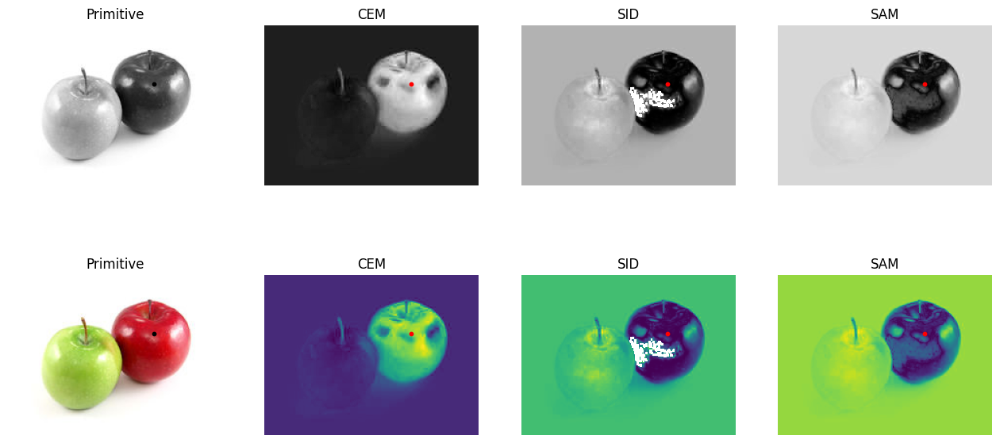

# Target-detection-apple

## 📐 SAM 公式
Spectral Angle Mapper (SAM) 是一種用於光譜資料分析的技術，可評估兩個光譜之間的相似程度。它常被應用於高光譜影像處理、分類與目標識別任務中。
SAM 根據兩個光譜向量之間的夾角進行比對，定義如下：

---

θ = arccos[(r · d) / (||r|| · ||d||)]

- \( \vec{r} \)：參考光譜向量（target spectrum）
- \( \vec{d} \)：像素光譜向量（image spectrum）
- \( \theta \)：兩光譜之間的角度（以弧度計）

---

